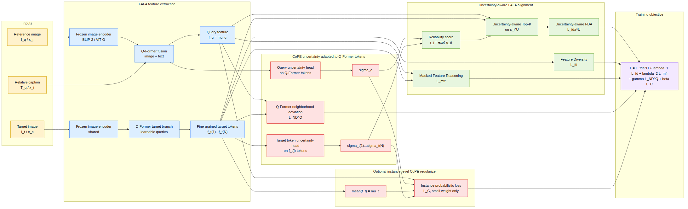
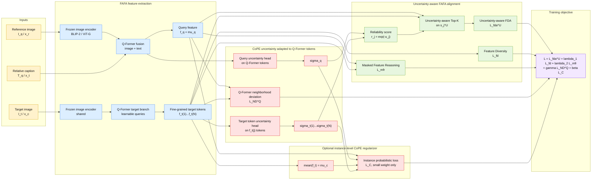
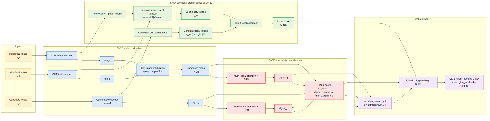
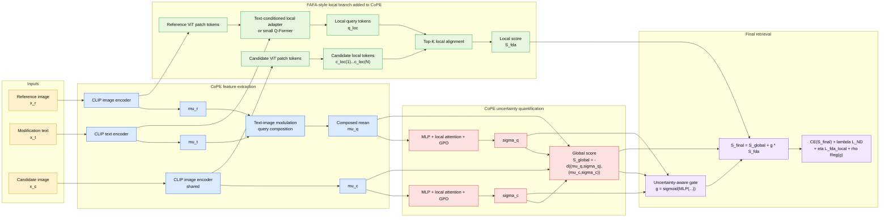
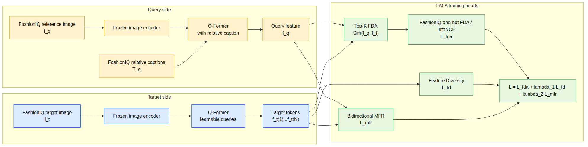
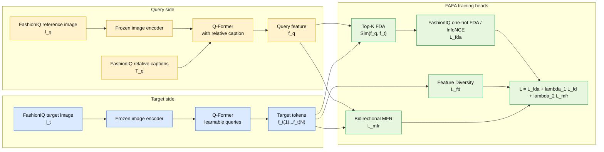
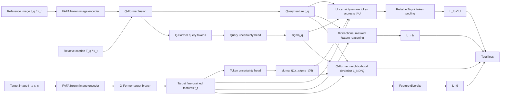
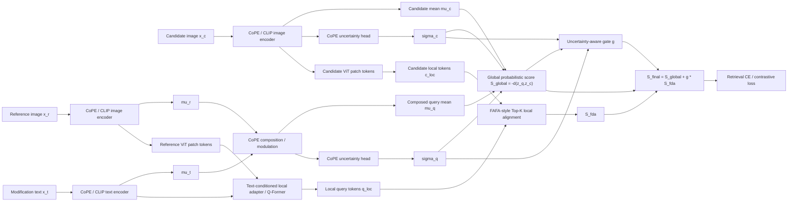
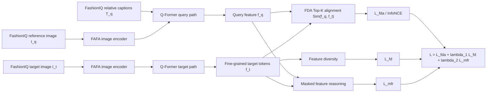

# Ba hướng kết hợp FAFA và CoPE

Mục tiêu của tài liệu này là đặt ba hướng lên cùng một mặt phẳng:

1. Đưa CoPE vào FAFA.
2. Đưa FAFA vào CoPE.
3. Chạy FAFA trực tiếp trên FashionIQ.

Kết luận ngắn gọn: nếu mục tiêu là không mất thời gian, nên chạy FAFA trên FashionIQ trước để kiểm tra xem cơ chế fine-grained của FAFA có thật sự có tín hiệu trên bài toán composed image retrieval hay không. Nếu có tín hiệu, hướng đáng làm tiếp là đưa FAFA vào CoPE bằng một nhánh local-token được huấn luyện. Không nên bắt đầu bằng post-hoc rerank vì thử nghiệm trước đó gần như không cải thiện.

## Sơ đồ trực quan kiểu bài báo

Phần này cố tình vẽ theo bố cục của hai hình trong paper:

- CoPE: bên trái là feature extraction, bên phải là uncertainty quantification.
- FAFA: query side dùng reference image + relative caption, target side dùng target image, sau đó FDA / MFR ở phía loss.

### Sơ đồ A: CoPE đưa vào FAFA

Đây không nên hiểu là "bê nguyên CoPE loss vào FAFA". Bản đúng đắn hơn là: FAFA vẫn làm backbone chính, nhưng uncertainty của CoPE phải tác động trực tiếp vào **token selection**, **Top-K alignment score**, và **loss weighting** của FAFA. Nếu uncertainty chỉ được thêm như một loss phụ bên cạnh `L_fda`, nó yếu và không giải quyết điểm đau cụ thể nào.





Đọc hình này như sau:

- Đường chính vẫn là FAFA: `I_q + T_q -> Q-Former -> f_q`, `I_t -> Q-Former -> f_t`, rồi tính `Sim(f_q, f_t)` bằng Top-K local alignment.
- CoPE không chỉ là nhánh phụ. Nó tạo `sigma_q` và `sigma_t(j)` để biết query/token nào đáng tin.
- FDA không còn chọn Top-K chỉ theo cosine, mà chọn theo score đã hiệu chỉnh bởi uncertainty.
- `L_C` nếu dùng thì chỉ nên là regularizer nhỏ ở mức instance. Phần chính phải là `L_fda^U`, tức uncertainty-aware FDA.

### Sơ đồ B: FAFA đưa vào CoPE

Đây là hướng ngược lại: CoPE giữ vai trò global retrieval chính, còn FAFA bổ sung local fine-grained branch. Hình này bám theo CoPE ở phần `mu / sigma`, rồi thêm một nhánh token alignment giống FAFA.





Đọc hình này như sau:

- CoPE vẫn tạo score toàn cục `S_global` từ `(mu_q, sigma_q)` và `(mu_c, sigma_c)`.
- FAFA không thay thế CoPE, mà thêm một nhánh `q_loc` so với `c_loc(j)` để bắt chi tiết local.
- Gate `g` dùng uncertainty để quyết định lúc nào nên tin local alignment nhiều hơn.
- Đây là hướng đúng về mặt nghiên cứu nếu muốn xử lý limitation fine-grained của CoPE.

### Sơ đồ C: FAFA chạy trực tiếp trên FashionIQ

Đây là baseline cần làm trước. Nó gần giống FAFA gốc nhất, chỉ thay dữ liệu person retrieval bằng FashionIQ.





Đọc hình này như sau:

- Đây không phải hướng kết hợp, mà là phép thử transfer của FAFA sang FashionIQ.
- Vì FashionIQ không có identity / group identity như SynCPR, `L_fda` nên bắt đầu bằng one-hot target trước, không nên vội bịa partial label `alpha`.
- Nếu sơ đồ C chạy không có tín hiệu, sơ đồ B không nên triển khai sâu.

## Ký hiệu dùng chung

Theo CoPE:

- `x_r`: reference image.
- `x_t`: modification text.
- `x_c`: candidate / target image.
- `mu_r, mu_t, mu_c`: mean embedding của reference, text, candidate.
- `sigma_r, sigma_t, sigma_c`: uncertainty embedding tương ứng.
- `L_C`: contrastive / probabilistic retrieval loss của CoPE.
- `L_ND`: Neighborhood Deviation Loss, dùng độ lệch của lân cận để ép uncertainty có ý nghĩa.

Theo FAFA:

- `I_q`: reference image ở query side.
- `T_q`: relative caption.
- `I_t`: target image.
- `f_q`: query feature sau Q-Former.
- `f_t = {f_t(1), ..., f_t(N)}`: tập fine-grained target features từ Q-Former.
- `L_fda`: Fine-grained Dynamic Alignment loss.
- `L_fd`: Feature Diversity loss.
- `L_mfr`: Masked Feature Reasoning loss.

Điểm khác nhau quan trọng:

- CoPE gốc làm việc chủ yếu ở mức vector toàn cục: `mu` và `sigma`.
- FAFA làm việc ở mức token / local feature: `f_q` so với nhiều token `f_t(j)`.
- Vì vậy, "ghép" hai bài không thể chỉ cộng bừa hai score. Phải quyết định rõ nhánh nào là backbone chính và nhánh nào là regularizer / local adapter.

## Hướng 1: Đưa CoPE vào FAFA

Ý tưởng đúng đắn hơn: giữ FAFA làm backbone chính, nhưng đưa uncertainty của CoPE vào đúng chỗ FAFA dễ sai nhất: **chọn local token nào để align**.

FAFA dùng Top-K trên các token `f_t(j)`. Cơ chế này mạnh vì bắt được chi tiết nhỏ, nhưng cũng có điểm yếu: nếu một token target có cosine cao do nhiễu, background, pose, hoặc caption mơ hồ, Top-K có thể kéo score lên sai. CoPE có ý nghĩa ở đây nếu nó học được độ không chắc chắn của query/token và làm cho FDA bớt overconfident.

Vì vậy, hướng này không nên là:

```text
L = L_fda + lambda_1 L_fd + lambda_2 L_mfr + beta L_C
```

với `L_C` treo bên cạnh. Công thức đó chỉ là bản dễ làm, nhưng yếu về mặt nghiên cứu.

Hướng nên làm là:

```text
FAFA + CoPE = Uncertainty-aware Fine-grained Dynamic Alignment
```



Similarity chính của FAFA:

```text
Sim(f_q, f_t) =
  (1 / k) * sum_{i=1}^{k} TopK_i(
    { cos(f_q, f_t(j)) }_{j=1}^{N}
  )
```

FDA distribution matching:

```text
p_{i,j} = softmax(Sim(f_q^i, f_t^j) / tau)

q_{i,j} =
  1      nếu cùng identity
  alpha  nếu cùng group identity / partial match
  0      nếu không match

L_q2t = (1 / B) * sum_i KL(p_i || q_i)
L_t2q = reverse direction
L_fda = L_q2t + L_t2q
```

Các loss gốc của FAFA:

```text
L_fd =
  1 / (N(N - 1)) * sum_{i != j}
    max(cos(f_t(i), f_t(j)) - m, 0)

L_mfr =
  E[ || f_q - Phi([mean(f_t), masked(f_q)]) ||_2^2
   + || mean(f_t) - Phi([f_q, masked(mean(f_t))]) ||_2^2 ]

L_FAFA = L_fda + lambda_1 * L_fd + lambda_2 * L_mfr
```

Thiết kế CoPE vào FAFA nên sửa score local trước. Gọi:

```text
mu_q = f_q
mu_tj = f_t(j)

sigma_q  = uncertainty của query
sigma_tj = uncertainty của target token j
u_j = mean(sigma_q) + mean(sigma_tj)
```

Thay vì dùng cosine thô:

```text
s_j = cos(f_q, f_t(j))
```

dùng score có xét độ tin cậy:

```text
s_j^U = cos(f_q, f_t(j)) - alpha_u * u_j
```

hoặc dạng probabilistic distance chặt hơn:

```text
d_j^U =
  ||mu_q - mu_tj||_2^2 / (sigma_q^2 + sigma_tj^2 + eps)
  + log(sigma_q^2 + sigma_tj^2 + eps)

s_j^U = -d_j^U
```

Sau đó FDA dùng Top-K trên `s_j^U`:

```text
TopK_U = TopK({s_j^U}_{j=1}^{N})

w_j = softmax(-u_j / tau_u), với j thuộc TopK_U

Sim_U(f_q, f_t) =
  sum_{j thuộc TopK_U} w_j * cos(f_q, f_t(j))
```

Loss chính:

```text
L_fda^U =
  KL(softmax(Sim_U / tau) || q)
  + reverse direction nếu training bidirectional
```

Regularizer uncertainty cần có, nếu không `sigma` rất dễ thành hằng số vô nghĩa:

```text
L_ND^Q =
  || sigma_q - deviation(N_q) ||_2^2
  + mean_j || sigma_tj - deviation(N_tj) ||_2^2
```

Objective đề xuất:

```text
L_FAFA+CoPE-correct =
  L_fda^U
  + lambda_1 * L_fd
  + lambda_2 * L_mfr
  + gamma * L_ND^Q
  + beta * L_C_instance
```

Trong đó `beta` nên nhỏ. `L_C_instance` chỉ là phụ, ví dụ dùng `(f_q, sigma_q)` và `(mean(f_t), mean_j sigma_tj)` để giữ tương thích với tinh thần CoPE. Nếu bỏ `L_C_instance` vẫn được; phần đáng nghiên cứu là `L_fda^U + L_ND^Q`.

Đánh giá trung thực:

- Ưu điểm: câu chuyện hợp lý hơn: CoPE giúp FAFA biết token nào không chắc, thay vì ép mọi Top-K token có giá trị như nhau.
- Ưu điểm: bám đúng hình FAFA vì vẫn giữ Q-Former, `f_q`, `f_t`, FDA, MFR.
- Ưu điểm: bám đúng tinh thần CoPE vì uncertainty không chỉ để báo cáo, mà đi vào scoring và loss.
- Nhược điểm: phải train uncertainty thật. Nếu `sigma` bị hằng số, hướng này coi như thất bại.
- Nhược điểm: cần cẩn thận để uncertainty không trở thành đường tắt làm giảm loss bằng cách phạt mọi token khó.
- Nhược điểm cho FashionIQ: FAFA là person-centric, còn FashionIQ là product-centric. Không có ID/GID rõ như SynCPR nên `L_fda` phải sửa.

Kết luận cho hướng này: nếu nói "CoPE vào FAFA" cho đúng nghĩa, nên làm uncertainty-aware FDA như trên. Bản chỉ thêm `CoPELoss` vào FAFA là baseline kỹ thuật, không phải hướng nghiên cứu tốt.

## Hướng 2: Đưa FAFA vào CoPE

Ý tưởng: giữ CoPE làm backbone chính cho FashionIQ, vì CoPE vốn được thiết kế cho composed image retrieval. Sau đó thêm một nhánh fine-grained local alignment kiểu FAFA để xử lý limitation "thiếu fine-grained reasoning".

Đây là hướng có ý nghĩa nghiên cứu nhất cho FashionIQ, nhưng cũng là hướng khó nhất. Lý do: CoPE gốc dùng vector embedding toàn cục, không có Q-Former như FAFA. Muốn đưa FAFA vào CoPE thì phải tạo local-token branch có huấn luyện, không nên chỉ lấy patch token rồi rerank sau huấn luyện.



Global score của CoPE:

```text
z_q = (mu_q, sigma_q)
z_c = (mu_c, sigma_c)

S_global(q, c) = -d(z_q, z_c)
```

Local score kiểu FAFA:

```text
S_fda(q, c) =
  (1 / k) * sum_{i=1}^{k} TopK_i(
    { cos(q_loc, c_loc(j)) }_{j=1}^{N}
  )
```

Gated fusion:

```text
g = sigmoid(MLP([sigma_q, sigma_c, margin_global]))

S_final(q, c) =
  S_global(q, c) + g * S_fda(q, c)
```

Loss đề xuất:

```text
L_CoPE+FAFA =
  CE(S_final)
  + lambda * L_ND
  + eta * L_fda_local
  + rho * Reg(g)
```

Trong đó:

- `CE(S_final)` là loss truy hồi chính trên score đã ghép.
- `L_ND` giữ uncertainty của CoPE có ý nghĩa.
- `L_fda_local` ép nhánh local học alignment thật, không chỉ phụ thuộc vào global score.
- `Reg(g)` tránh gate luôn bằng 0 hoặc luôn bằng 1.

Nếu muốn giữ nguyên CoPE loss gốc song song:

```text
L_CoPE+FAFA =
  L_C
  + CE(S_final)
  + lambda * L_ND
  + eta * L_fda_local
  + rho * Reg(g)
```

Đánh giá trung thực:

- Ưu điểm: đây là hướng có câu chuyện nghiên cứu sạch nhất: CoPE mạnh ở uncertainty/global retrieval nhưng thiếu fine-grained local alignment; FAFA bổ sung đúng phần đó.
- Ưu điểm: phù hợp nhất nếu muốn train/test trên FashionIQ trước.
- Nhược điểm: không thể chỉ "gắn FAFA" vào CoPE bằng vài dòng score. CoPE không có Q-Former; phải thêm local adapter hoặc Q-Former nhỏ.
- Nhược điểm: tốn công train và tuning hơn. Nếu máy yếu, cần chạy theo stage nhỏ: freeze CoPE, train local adapter trước, sau đó mới mở dần.
- Nhược điểm: thử nghiệm post-hoc trước đó không cải thiện R@10/R@50, nên nếu làm hướng này bắt buộc phải huấn luyện nhánh local, không bán kết quả rerank như một đóng góp chính.

Kết luận cho hướng này: đây là hướng đáng làm nhất nếu muốn một hướng nghiên cứu có ý nghĩa trên FashionIQ. Nhưng nó chỉ đáng làm sau khi chứng minh FAFA/FDA có tín hiệu trên FashionIQ.

## Hướng 3: Chạy FAFA trực tiếp trên FashionIQ

Ý tưởng: chưa kết hợp gì vội. Lấy FAFA chạy lại trên FashionIQ để trả lời câu hỏi nền tảng: fine-grained alignment của FAFA có giúp composed image retrieval ngoài miền person retrieval không?



Loss gần với FAFA gốc:

```text
L_FashionIQ-FAFA =
  L_fda
  + lambda_1 * L_fd
  + lambda_2 * L_mfr
```

Nhưng cần sửa `L_fda` vì FashionIQ không có label identity / group identity giống SynCPR:

```text
q_{i,j} =
  1 nếu j là target đúng của query i
  0 nếu không phải target đúng
```

Tức là bản đơn giản nhất biến `L_fda` thành one-hot KL / InfoNCE:

```text
p_{i,j} = softmax(Sim(f_q^i, f_t^j) / tau)
L_fda = (1 / B) * sum_i KL(p_i || one_hot(i))
```

Không nên tự tạo partial label `alpha` nếu chưa có cơ sở. Có thể thử sau bằng category-level label như `dress`, `shirt`, `toptee`, nhưng đó là một giả định mới, không còn là FAFA gốc.

Đánh giá trung thực:

- Ưu điểm: đây là baseline sạch nhất và cần thiết nhất.
- Ưu điểm: cho biết FAFA có transfer được từ person retrieval sang FashionIQ hay không.
- Ưu điểm: nếu FAFA chạy tốt, lúc đó mới có lý do mạnh để đưa FAFA vào CoPE.
- Nhược điểm: không phải một phương pháp kết hợp, nên chưa đủ làm đóng góp chính nếu kết quả chỉ ngang hoặc kém CoPE.
- Nhược điểm: FashionIQ không có ID/GID như FAFA cần, nên mất một phần lợi thế của FDA distribution matching.
- Nhược điểm: FAFA dùng BLIP-2/Q-Former nặng hơn CoPE; train có thể khó hơn trên máy cá nhân.

Kết luận cho hướng này: nên làm đầu tiên. Nó là phép thử rẻ nhất để tránh xây một hệ kết hợp phức tạp trên một giả định chưa được chứng minh.

## So sánh ba hướng

| Hướng | Mục tiêu chính | Độ khó | Giá trị nghiên cứu | Rủi ro | Nhận xét thẳng |
|---|---:|---:|---:|---:|---|
| CoPE vào FAFA | Cải thiện FAFA trên SynCPR/ITCPR bằng uncertainty | Trung bình | Trung bình | Trung bình | Dễ nhất vì folder cũ đã có khung, nhưng giống auxiliary loss hơn là đóng góp lớn |
| FAFA vào CoPE | Bổ sung fine-grained reasoning cho CoPE trên FashionIQ | Cao | Cao | Cao | Đáng làm nhất nếu có tín hiệu từ FAFA-FashionIQ, nhưng phải train nhánh local thật |
| FAFA chạy FashionIQ | Kiểm tra FDA/Q-Former có transfer sang FashionIQ không | Trung bình | Trung bình | Thấp-Trung bình | Nên làm đầu tiên để ra quyết định, dù chưa phải phương pháp kết hợp |

## Thứ tự triển khai đúng đắn

### Bước 1: FAFA trên FashionIQ

Chạy baseline này trước.

Lý do: nếu FAFA không có tín hiệu trên FashionIQ, việc đưa FAFA vào CoPE sẽ dễ thành một nhánh phức tạp nhưng không đóng góp. Đây là bước kiểm chứng giả thuyết, không phải bước phụ.

Kết quả cần xem:

- `R@10`, `R@50` trên `dress`, `shirt`, `toptee`.
- So với CoPE đã train lại.
- Case study: FAFA đúng những ca nào mà CoPE sai.
- Nếu FAFA kém CoPE nhưng đúng một nhóm lỗi fine-grained cụ thể, vẫn có lý do để fusion.

Điều kiện đi tiếp:

```text
Nếu FAFA-FashionIQ gần CoPE hoặc bổ sung lỗi khác CoPE:
  tiếp tục hướng FAFA vào CoPE.

Nếu FAFA-FashionIQ kém xa và không có complementarity:
  không nên xây fusion FAFA-CoPE trên FashionIQ.
```

### Bước 2: FAFA vào CoPE bằng trainable local branch

Chỉ làm sau khi bước 1 có tín hiệu.

Thiết kế tối thiểu nên là:

```text
CoPE global branch:
  (mu_q, sigma_q), (mu_c, sigma_c), S_global

FAFA local branch:
  q_loc, c_loc, S_fda

Fusion:
  S_final = S_global + g * S_fda

Training:
  L = CE(S_final) + lambda L_ND + eta L_fda_local + rho Reg(g)
```

Không nên làm:

```text
S_final = S_CoPE + alpha * S_FAFA_posthoc
```

Lý do: thử nghiệm rerank/post-hoc trước đó không cải thiện rõ `R@10/R@50`. Nếu nhánh local không được train cùng objective, nó không học cách bổ sung cho CoPE.

### Bước 3: CoPE vào FAFA cho SynCPR/ITCPR

Làm hướng này nếu muốn quay về bài toán composed person retrieval.

Thiết kế hợp lý:

```text
L = L_fda + lambda_1 L_fd + lambda_2 L_mfr + beta L_C + gamma L_ND^QFormer
```

Nhưng cần kiểm tra kỹ:

- `sigma` có bị gần hằng số không.
- `L_C` có thật sự làm tăng retrieval hay chỉ làm regularization.
- Evaluation có dùng probabilistic score hay vẫn dùng FDA score.
- Dấu và scale trong CoPE loss có đúng không.

## Khuyến nghị cuối

Nếu phải chọn một đường đi thực dụng:

1. Chạy FAFA trên FashionIQ trước.
2. Nếu có tín hiệu, triển khai FAFA vào CoPE bằng local-token branch có train.
3. Chỉ dùng CoPE vào FAFA khi mục tiêu chuyển về SynCPR/ITCPR.

Nói thẳng: hướng "CoPE vào FAFA" dễ làm nhất nhưng không phải hướng mạnh nhất cho FashionIQ. Hướng "FAFA vào CoPE" mới khớp với limitation của CoPE, nhưng sẽ tốn công và chỉ đáng làm khi baseline FAFA-FashionIQ chứng minh fine-grained alignment có ích. Nếu bỏ qua bước baseline này, nguy cơ cao là mình sẽ train một mô hình lai rất phức tạp mà không biết phần nào đang tạo giá trị.
